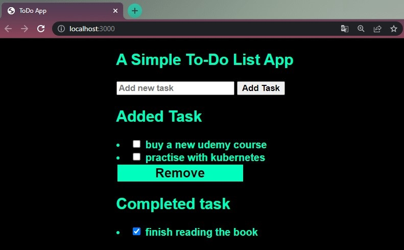
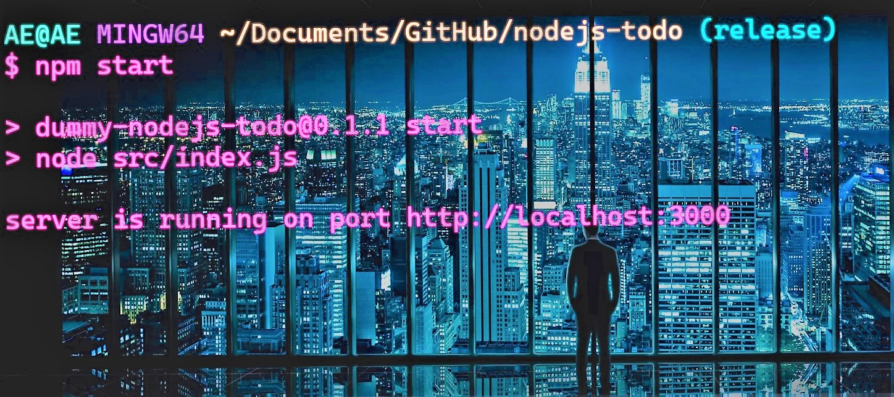

<!-- <div align="center" id="top">
  

  &#xa0;

</div> -->

# Continuous Delivery Pipeline

Este repositório contém um pipeline de Continuous Delivery que integra o uso de Terraform, Docker e Ansible para gerenciar a infraestrutura na Magalu Cloud, construir e implantar imagens Docker, e configurar servidores remotamente.

## Fluxo de Trabalho

O pipeline é composto por três principais blocos de trabalho definidos em GitHub Actions:

1. **Terraform Infrastructure Deployment**
2. **Docker Image Build and Push**
3. **Ansible Server Configuration and Deployment**

## 1. Terraform Infrastructure Deployment

#### Evento de Gatilho

Este job é acionado sempre que houver um push nos arquivos `.tf` no repositório:

```yaml
on:
  push:
    paths:
      - "**/*.tf"
```

**Etapas do Job**

- Setup Terraform: Configura o ambiente Terraform.
- Checkout Repo: Clona o repositório para acessar o código.
- Terraform Init: Inicializa o diretório Terraform.
- Terraform Validate: Valida a configuração do Terraform.
- Terraform Apply: Aplica as mudanças no Terraform.

### Variáveis de Ambiente

- `GITHUB_TOKEN`: Token de autenticação para GitHub.

- `TF_VAR_mgc_api_key`: API Key para Magalu Cloud.

- `TF_VAR_mgc_region`: Região da Magalu Cloud.

## 2. Docker Image Build and Push

**Evento de Gatilho**

Este job é acionado em push para a branch main:

```yaml
on:
  push:
    branches:
      - main
```

### Etapas do Job

1. Setup Docker Buildx: Configura o ambiente de build Docker.

2. Docker Login: Autentica no Docker Hub.

3. Build and Push Docker Images: Constrói e publica a imagem Docker no Docker Hub.

### Variáveis de Ambiente

`USERNAME_DOCKER_HUB`: Nome de usuário do Docker Hub.

`PASSWORD_DOCKER_HUB`: Senha (api-key) do Docker Hub.

## 3. Ansible Server Configuration and Deployment

**Dependência**

Este job depende da conclusão do job Docker.

### Etapas do Job

1. **Checkout Repo**: Clona o repositório.

2. **Setup SSH Key**: Configura a chave SSH para acesso aos servidores.

3. **Run Ansible Playbook**: Executa o playbook Ansible para configurar o servidor.

### Variáveis de Ambiente

- `SSH_PRIVATE_KEY`: Chave privada SSH para acessar o servidor.

- `SSH_HOST`: Endereço do servidor remoto.

**O playbook Ansible realiza as seguintes tarefas:**

Atualiza o cache de pacotes e instala dependências para Docker.

Adiciona a chave GPG e repositório do Docker.

Instala e inicia o serviço Docker.

Atualiza a imagem Docker e reinicia o contêiner com a nova imagem.

### Considerações Finais

Certifique-se de que todas as variáveis de ambiente e segredos estejam devidamente configurados antes de executar o pipeline.
O pipeline está configurado para aplicar automaticamente mudanças de infraestrutura e atualizações de contêineres; revise cuidadosamente todos os scripts e configurações antes de permitir execuções automáticas em ambientes de produção.

<h1 align="center">To Do Web App served with Node.js and Express.js</h1>

<p align="center">
  
  
  
  
  
  
  
  
  <!--  -->
  <!--  -->
  <!--  -->
</p>

<!-- Status -->

<!-- <h4 align="center">
	🚧  Dummy Nodejs Todo 🚀 Under construction...  🚧
</h4>

<hr> -->

<p align="center">
  <a href="#dart-about">About</a> &#xa0; | &#xa0; 
  <a href="#sparkles-features">Features</a> &#xa0; | &#xa0;
  <a href="#rocket-technologies">Technologies</a> &#xa0; | &#xa0;
  <a href="#white_check_mark-requirements">Requirements</a> &#xa0; | &#xa0;
  <a href="#checkered_flag-starting">Starting</a> &#xa0; | &#xa0;
  <a href="#memo-license">License</a> &#xa0; | &#xa0;
  <a href="https://github.com/devenes" target="_blank">Author</a>
</p>

<br>

## :dart: About

Simple To Do application built with Node.js and Express.js that lets you add tasks on a single page, store new and finished tasks in different arrays. Containerized with Docker and tested with NPM through GitHub Actions pipeline.

## :sparkles: Features

:heavy_check_mark: **Add tasks** \
:heavy_check_mark: **Store tasks** \
:heavy_check_mark: **Delete tasks**

## :rocket: Technologies

The following tools were used in this project:

- [Node.js](https://nodejs.org/en/)
- [Javascript](https://www.javascript.com/)
- [Express.js](https://expressjs.com/)
- [Docker](https://www.docker.com/)
- [NPM](https://www.npmjs.com/)
- [Body-parser](https://www.npmjs.com/package/body-parser)
- [EJS](https://www.npmjs.com/package/ejs)
- [CSS](https://www.w3schools.com/css/default.asp)

## Embedded Javascript

EJS simply stands for Embedded Javascript. It is a simple templating language/engine that lets its user generate HTML with plain javascript. EJS is mostly useful whenever you have to output HTML with a lot of javascript. EJS is a simple templating language that lets you generate HTML markup with plain JavaScript. No religiousness about how to organize things. No reinvention of iteration and control-flow.

## Body-Parser

Body-Parser is the Node. js body parsing middleware. It is responsible for parsing the incoming request bodies in a middleware before you handle it. This extracts the entire body portion of an incoming request stream and exposes it on req.body

## :white_check_mark: Requirements

Before starting :checkered_flag:, you need to have [Git](https://git-scm.com) and [Node](https://nodejs.org/en/) installed.

## Output



## :checkered_flag: Starting

```bash
# Clone this project
git clone https://github.com/devenes/node-js-dummy-test

# Access
cd node-js-dummy-test

# install all needed dependencies
npm install

# Start the app in the browser
npm start

# The server will initialize in the <http://localhost:8080>
```



## Test App

Run <code> npm test </code> to run the tests


## Build Docker Image with Dockerfile

Use the following commands in your `Dockerfile` to build a Docker image:

```dockerfile
FROM node:16-alpine
WORKDIR /app
COPY package*.json .
RUN npm install
COPY . .
EXPOSE 8080
CMD ["npm", "start"]
```

## Resources

- [Using workflow run logs](https://docs.github.com/en/actions/monitoring-and-troubleshooting-workflows/using-workflow-run-logs)

- [Understanding GitHub Actions](https://docs.github.com/en/actions/learn-github-actions/understanding-github-actions)

- [Node.js](https://www.yusufsezer.com.tr/node-js-npm/)

- [Todo App with Node.js](https://medium.com/@atingenkay/creating-a-todo-app-with-node-js-express-8fa51f39b16f)

- [npm-run-script](https://docs.npmjs.com/cli/v8/commands/npm-run-script)

- [npm-test](https://docs.npmjs.com/cli/v8/commands/npm-test)

- [npm](https://www.npmjs.com/)

## :memo: License

This project is under license from Apache 2.0. For more details, see the [LICENSE](LICENSE) file.

Made with :heart: by <a href="https://github.com/devenes" target="_blank">devenes</a>

&#xa0;

<a href="#top">⬆️ Back to top</a>
